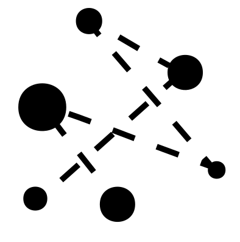

 
# Single Molecule Tracking and Diffusion

 *[Daniel Sage](mailto:daniel.sage@epfl.ch?subject=Single%20Molecule%20Tracking%20and%20Diffusion) — Ecole Polytechnique Fédérale de Lausanne, Switerzland*

> This module complements the youngSMLMS 2025 workshop. 


 

This hands-on module guides you to the quantitative single-particle diffusion analysis. Across four practices, you will:

- **Analyze SMLM data in Fiji**
- **Track particles** 
- **Understand diffusion Model in Python**
- **Integrate a SPT pipeline** 

By the end, you’ll understand the full SMLM/SPT pipeline—localization, tracking, diffusion modeling, and quantitative readouts through simple examples.


 


### Setting up Fiji
> **Prerequisite:** A laptop with installation permissions.

1. Download Fiji from the official website: [https://fiji.sc/](https://fiji.sc/)  
2. Update Fiji to the latest version.  
3. Install ThunderSTORM: [https://zitmen.github.io/thunderstorm/](https://zitmen.github.io/thunderstorm/)  


### Setting up the Jupyter environment


> **Prerequisite:** A Google account (preferably private).

1. Open [Google Colab](https://colab.research.google.com)  
2. Upload the notebooks from this GitHub repository.  
3. Go to **File > Save a copy in Drive** to keep your own editable version.  


> **Prerequisite:** A working Conda installation.

```
conda create --name spt-diffusion python=3.11
conda activate spt-diffusion

pip install notebook
pip install scikit-image scikit-learn
pip install andi-datasets deeptrack

jupyter notebook
```

<br>


 


###  Practice A - SMLM Data Analysis 

> **On Fiji**

- Handling sequences of Frames 
- Run QuickPALM
- Run ThunderSTORM
<br>
<hr>

###  Practice B - Particle Tracking

> **On Fiji**
- TrackMate

<br>
<hr>
 
###  Practice C - Modeling Molecular Diffusion

> **Python Notebook**

#### `simulation_brownian_motion.ipynb`
- Isotropic Brownian Motion
- Anisotropic Brownian Motion
- Non-homogeneous Brownian Motion

#### `simulation_anamalous_diffusion.ipynb`
- Test the 5 models provided by the ANDI Challenge
- Reference: https://github.com/AnDiChallenge/andi_datasets


#### `classification_trajectory.ipynb`
- Compute simple features
- Random Forest

<br>
<hr>


### Practice D - Final Practice

*TODO*

> **Python Notebook**

- Simulation of trajectory
- Generate noisy frames
- Tracking particles
- Compute MSD
